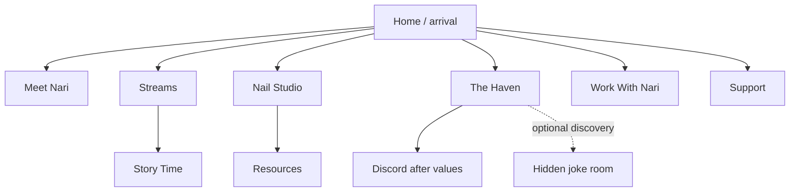

# Information Architecture and User Journeys

**Status:** `LOCKED` route model; content depth still evolving  
**Owns:** Navigation, route responsibility, audience journeys, CTA priority, metadata and empty-state policy  
**Implementation files:** `src/data/navigation.ts`, `src/router/index.ts`, HTML entry documents, `SiteHeader.vue`, `SiteFooter.vue`  
**Update trigger:** Route, audience, primary action, navigation order, or page responsibility changes

## Navigation thesis

Visitors enter a place, not a directory. Navigation names rooms and responsibilities without forcing the metaphor so hard that ordinary users get lost.

Primary header order:

1. Nari brand banner → Home
2. Meet Nari
3. Streams
4. The Haven
5. Work With Nari
6. More dropdown → Resources, Nail Studio, Story Time, Support

Header utilities:

- three-theme atmosphere switcher;
- external “Watch live” Twitch action.

Secondary/footer routes:

- Story Time;
- Support.

The routes remain unchanged. The compact header prioritizes identity, current content, community, and collaboration; supporting material remains available through the native More disclosure and the footer where applicable.

Social destinations belong in the footer and Resources directory. The Prinny Cult is absent from global navigation, sitemap intent, and normal CTA hierarchy.

## Site map

The diagram describes user flow, not implementation routing. Technical route construction lives in `07_TECHNICAL_ARCHITECTURE.md`.

## Route ownership

| Page | Owns | Must not become |
|---|---|---|
| Home | World arrival, short identity, three primary gateways, curated taste | Full bio, all links, full gallery, Discord/support funnel |
| Meet Nari | Privacy-safe identity, roles, symbols, boundaries, canon status | Unapproved lore encyclopedia or private biography |
| Streams | Stream feeling, selected media, channel map, schedule truth | Autoplay embed wall or scraped feed |
| Nail Studio | Authentic practice, education, future gallery, safety scope | Salon/services page or generated portfolio |
| The Haven | Community values, belonging, Discord discovery, secret threshold | General social wall or fake security gate |
| Resources | Reviewed recommendations and disclosures | Affiliate storefront or stale price list |
| Work With Nari | Collaboration fit, process, boundaries, approved contact | Corporate persona, fake metrics, nonfunctional form |
| Support | Optional free/financial support and entitlement boundary | Donation funnel or donor-status system |
| Story Time | Curated privacy-reviewed stories/moments | Automated feed or permanent index of private anecdotes |
| Secret room | Optional original joke and return path | Required navigation or copyrighted fandom page |
| 404 | Recovery and home path | Brand gag that hides the error |

## CTA hierarchy

| Level | Definition | Examples | Constraints |
|---|---|---|---|
| Primary | Best next action for the current context | Catch a stream; Enter Discord after values; Explore fit | Normally one per decision area |
| Secondary | Continue within the Haven | Meet your host; Open the studio; Read Story Time | May sit beside primary without equal visual weight |
| Tertiary | Source, alternate, reset, or external reference | Social directory; close/reset; source link | Clear destination and new-tab cue |
| Never primary | Money or intimacy before context | Throne, Discord on arrival, affiliate product | Must not dominate Home/hero/navigation |

CTA copy names the destination. Repeated “Learn more” and mystery navigation are not acceptable outside the optional secret.

## Audience journeys

### First-time viewer

**Entry:** Clip, Twitch profile, social post, search, direct link.  
**Path:** Home hero → Streams gateway or selected moment → Twitch/YouTube.  
**Question answered:** “What does spending time with Nari feel like?”  
**Success:** The visitor understands warmth, chaos, conversation, and boundaries before leaving for a platform.  
**Failure mode:** Link wall, generic biography, autoplay stream, or seven equal buttons.

### Returning Ghostie

**Entry:** Home or Haven direct link.  
**Path:** Haven values → progressive door → canonical Discord invite.  
**Question answered:** “Does this place still behave like us?”  
**Success:** Community values feel true and entry is available without manipulation.  
**Failure mode:** Discord treated as exclusivity, donor reward, or fake security challenge.

### Nail learner

**Entry:** Nail video, social profile, search, Home gateway.  
**Path:** Nail Studio → approved gallery/process → relevant Resources.  
**Question answered:** “What has Nari actually made or learned?”  
**Success:** Real work is legible, credited, and scoped; resources explain why they matter.  
**Failure mode:** Generated manicure, salon implication, unsafe absolute advice, or undisclosed affiliate wall.

### Professional visitor

**Entry:** Direct Work route, footer, Home professional strip.  
**Path:** Work With Nari → fit categories → process/boundaries → approved contact or media kit.  
**Question answered:** “Is Nari a fit, and what information should I send?”  
**Success:** Tone, scope, rights expectations, and next step are clear within one page.  
**Failure mode:** Invented metrics, generic corporate copy, private contact leak, or dead form.

### Optional supporter

**Entry:** Footer or direct Support route.  
**Path:** Optionality statement → free support → financial option if desired.  
**Question answered:** “Can I help without buying status?”  
**Success:** Presence and free support clearly count; financial support grants no access.  
**Failure mode:** Urgency, guilt, ranking, exclusive intimacy, or sticky donation UI.

### Story/VOD visitor

**Entry:** Streams, Story Time, external video.  
**Path:** Story shelf → content/rating context → outbound source.  
**Question answered:** “Which moments are worth my time, and what am I about to open?”  
**Success:** Selected content is sourced, removable, privacy-reviewed, and appropriately rated.  
**Failure mode:** Surprise adult content, private anecdote indexing, or feed scrape.

### Curious explorer

**Entry:** The Haven.  
**Path:** Values → floorboard → three deliberate inspections → key → hidden room → visible exit.  
**Question answered:** “Did I find something extra?”  
**Success:** Rewarding joke with keyboard/touch parity and no licensed imagery.  
**Failure mode:** Required information hidden behind it, hover-only trigger, or trapped navigation.

## Navigation behavior

Top-level links are ordinary anchors because every route is a real HTML document. At or below 56rem, navigation becomes an explicit menu button and full-width panel. At 30rem, links become one column.

Required behavior:

- menu button exposes `aria-expanded` and `aria-controls`;
- active page uses text/surface/underline, not color alone;
- Escape and link activation close the panel;
- background scroll locks while open;
- focus remains visible and ordered;
- theme labels become visible in the mobile panel;
- no essential route disappears to make the header fit.

Focus containment and focus return are a pending manual decision based on screen-reader/keyboard testing; do not claim them as implemented.

## Progressive disclosure rules

Progressive disclosure is allowed when it adds context, not when it withholds a normal task.

- Discord appears after values because the sequence communicates the social contract.
- The secret room appears after optional exploration because it is extra.
- Support terms appear before financial destinations because consent and boundaries matter.
- Adult-marked media shows rating/context before navigation.

Do not hide contact, accessibility controls, required disclosures, safety scope, or primary navigation behind a playful interaction.

## Empty and failure states

| Situation | Required behavior | Forbidden substitute |
|---|---|---|
| No schedule | Point to current verified channel notifications | Empty calendar or invented recurring time |
| No nail gallery | Explain that approved work is pending | Stock/generated manicure samples |
| No resources | Show categories and review standard as `curating` | Fake product cards |
| No professional contact | Use approved public hub/X and state the limitation | Guessed email or nonfunctional form |
| Expired Discord | Remove/disable final external action; preserve values; point to verified hub | Guessing or rotating invite codes |
| Thumbnail failure | Preserve title, description, and outbound link | Empty broken card |
| Unpublished story | Render nothing for the record | Blank skeleton or draft leak |
| Missing route | Serve branded `404.html` with Home action | SPA fallback pretending route exists |

## Footer contract

The footer provides:

- belonging statement;
- Story Time and Support;
- a small set of verified social destinations;
- placeholder/rights posture while relevant;
- no-tracking/privacy statement when final copy is approved.

It does not become a dense sitemap, newsletter funnel, Discord repeat, or second hero.

## URL and metadata policy

- Public routes use lowercase kebab-case with trailing slash.
- `404.html` is the only document-style exception.
- Each entry owns its title, description, viewport, theme color, icons, and robots intent.
- Add canonical URLs only after the production domain exists.
- Add social preview art only after rights clearance and crop review.
- Secret and 404 documents use `noindex`; `robots.txt` defense-in-depth is not a privacy boundary.
- Route-specific claims in metadata follow the same approval rules as visible copy.

## Measurement without surveillance

No analytics is approved. Journey success is evaluated during design review, usability checks, link verification, and—only if later approved—purpose-limited privacy-respecting measurement with a documented event taxonomy and retention policy. Do not add tracking to “prove” the IA before those decisions exist.
