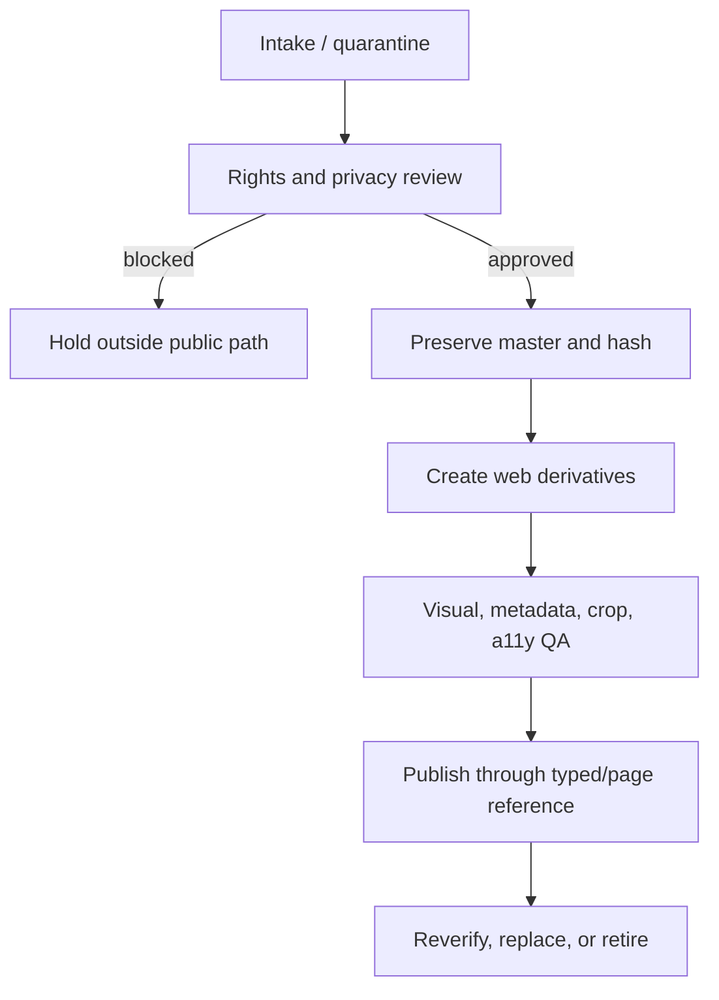

# Asset Manifest and Art Pipeline

**Status:** Owner-supplied authentic-artwork private review `IMPLEMENTED`; public-production artwork permissions `BLOCKED`
**Audit baseline:** 2026-08-13 at `b65e1c5a6da5a35f4f4f5969465c13f32f277912`  
**Owns:** Asset inventory, provenance, rights, naming, source preservation, derivatives, alt/credit, replacement and retirement  
**Update trigger:** Any image, icon, logo, font, clip, screenshot, emote, or other media enters, changes, or leaves the repository

## 2026-08-23 owner-supplied private-review intake

The owner-supplied `Nari.zip` project archive contains the actual `Model_File.png`, supplied `Assets/comfy.png`, 12 static Nari emotes, and 27 `Assets/PrinnysForThrow/*.png` source designs. The repository owner explicitly requested retention of that real model and those original Prinnies, then separately authorized an identity-preserving reillustration anchored directly to the actual supplied model for a bespoke storybook redesign. Original model derivatives, emotes, and all 27 Prinny designs remain available and unchanged in identity. No public-reference-based Nari substitute, generated Prinny replacement, or counterfeit nail portfolio is permitted.

The original 1789×4516 model has SHA-256 `abbea0e43bb9d99f9cf8d9d2d7b4cc2153a730308b466e7c71f86c55ab5675a9`; supplied 1254×1254 cozy art has SHA-256 `e3e40bc86dbaef9e67786548a667df0782d35063013742a8ea14c9a885cabbbf`. Originals remain in the owner-supplied source archive and are not served. `scripts/prepare-client-assets.sh` produces metadata-stripped local WebP derivatives, removing only the model's connected white source backdrop and preserving all 27 Prinny compositions without redrawing or invented lore.

| Review family | Local derivatives | Provenance | Public-release status |
|---|---|---|---|
| Actual Nari model and supplied cozy art | `public/media/nari/` | Owner-supplied archive | Blocked pending artist, exact rights, credit, and model-version approval |
| Official static Nari emotes | `public/media/emotes/` | Owner-supplied archive | Blocked pending original artist attribution and exact website rights |
| 27 original Prinny designs | `public/media/prinny-cult/roster/` | Owner-supplied archive; resize/format derivatives only | Blocked pending underlying artist/character/franchise permissions |
| Illustrated Prinny sanctuary and ritual altar | `public/media/prinny-cult/prinny-{sanctum,altar}-illustrated-v2.webp` | Newly generated, character-free storybook environments; existing supplied Prinnies are layered separately in code | Owner-directed private-review implementation; final owner/Nari adoption and public website-use review pending |
| Owner-authorized storybook Nari | `public/media/storybook/characters/` and app icons | Illustrated derivative referenced directly against supplied `Model_File.png`; identity invariants recorded in ADR-008 | Private-review authorized; public model-artist/derivative rights and Nari approval remain blocked |
| Eight illustrated chapter rooms and three Haven hours | `public/media/storybook/{scenes,postcards,share}/` | Original character-led artwork with model-anchored Nari, including dedicated integrated Home and Meet Nari paintings | Public character-derivative rights, artist terms, and adoption approval remain blocked |
| Five illustrated storybook Ghosties | `public/media/storybook/ghosties/` | Newly generated original companion family; not official emote substitutions | Final owner/Nari adoption and website-use review pending |
| Nari-adjacent Ghostie support characters | `public/media/ghosties/` | Previously generated project assets; no generated Nari likeness | Owner adoption and final style/rights review pending |
| Illustrated room environments | `public/media/environments/` and page asset folders | Authored SVG scenes plus prior generated support packs | Owner adoption and final production review pending |
| UI, metadata, states, motifs, and page packs | `public/media/{identity,streams,nails,resources,work,motifs,states,share,ui}/` | Previously generated project asset batches | Owner adoption, mark/metadata approval, and rights review pending |

See the intake records under [`asset-records/`](asset-records/), [`23_AUTHENTIC_ARTWORK_IMPLEMENTATION.md`](23_AUTHENTIC_ARTWORK_IMPLEMENTATION.md), and [`24_STORYBOOK_ART_DIRECTION_AND_PROMPTS.md`](24_STORYBOOK_ART_DIRECTION_AND_PROMPTS.md). Private repository implementation is not permission to publish commissioned, model-derived, or franchise-associated material publicly.

## Non-negotiable rule

Public visibility is not permission.

Do not copy, hotlink, crop, animate, recolor, trace, or publicly republish Nari's model, commissioned art, emotes, banners, panels, nail photos, community images, sponsor marks, or heritage art until the specific website rights are recorded. Owner-directed private review of the supplied archive is documented above; that bounded implementation exception is not public-release clearance.

An artist credit is not a license. Ownership is not automatically permission to create derivatives. Platform use is not automatically independent website use.

## Storage model

```text
src/assets/source/            # Current project masters; never served directly
public/media/generated/       # Optimized derivatives currently served
public/                       # Icons, manifest, robots, static host files
docs/templates/               # Intake and approval records
```

Future canonical assets should follow the same separation:

```text
src/assets/source/canonical/<family>/
public/media/<family>/
```

If original contractual material must not live in Git, store it in the owner-approved private archive and commit only permitted web derivatives plus a manifest record pointing to the archive identifier. Do not invent an archive path before one is chosen.

## Asset lifecycle



No asset skips from “found online” to `public/`.

## Current source placeholders

These are original project placeholders, not canonical Nari artwork. File sizes and SHA-256 values describe the implementation snapshot.

| Source | Dimensions / alpha | Size | Purpose | Rights posture | SHA-256 |
|---|---|---:|---|---|---|
| `src/assets/source/nari-haven-hero-environment-placeholder-v1.webp` | 1672×941 RGB | 124,930 B | Home environment master | Project-generated placeholder; final owner license pending | `651c64f3ffa8e7a0312559c6984e74fe87da482e999dc85e488d257ad57feb3c` |
| `src/assets/source/ghostie-mascot-v1.png` | 1254×1254 RGBA | 598,496 B | Original placeholder mascot master | Project-generated placeholder; not official Ghostie/emote | `00b24ccb3f03fca3d618e4709961450ca6289447fcaabe18c6cfb0815c545105` |
| `src/assets/source/nari-nuna-nail-studio-editorial.webp` | 1568×1003 RGB | 97,886 B | Nail Studio environment master | Project-generated placeholder; not Nari's work/room | `5f7b52295dabd9e9864e4c8a8b6bca7197f25a2130427acf23c67ab199e66d77` |

The two opaque source WebPs intentionally share their Git blob with the largest served derivative. The mascot alpha master remains a separate PNG.

## Current served derivatives

| Family | Files | Delivery contract |
|---|---|---|
| Haven hero | `nari-haven-hero-{640,1024,1440,1672}.webp` | Responsive `srcset`; above-fold high priority; explicit dimensions |
| Ghostie | `ghostie-{128,256,512,768}.webp` | Alpha preserved; select nearest non-upscaled size |
| Nail Studio | `nari-nail-studio-{640,1024,1568}.webp` | Responsive `srcset`; above-fold high priority; explicit dimensions |
| Icons | `favicon.png`, `apple-touch-icon.png`, `icon-192.png`, `icon-512.png` | Owner-authorized model-anchored storybook Nari portrait on an ink-dark backdrop |

Source masters are not ordinary browser payloads. Optimized output is local; there is no public-CDN dependency for project art.

## Public-reference audit — not licensed for production

| Surface | Visible reference | Possible rights lead | Current decision |
|---|---|---|---|
| Linktree | Nari avatar/chibi | Nari/commission artist | Reference only; do not hotlink |
| Twitch | Profile, banner, panels, emotes | Model Kansla; rig Toto; emotes Haru; banner Famocii1; panels Mikiqt, as publicly credited | Verify exact asset/artist and website rights |
| X | Current CatDog portrait/banner, later emote credits | Nari; Xylnaeri for later pair | Reference only |
| YouTube | Cropped profile/banner and thumbnails | Nari/underlying artist/platform | Channel art not a source master |
| Discord | Guild icon/splash | Nari/underlying artist | Private/community surface; permission required |
| Throne | Chibi card | Nari/underlying artist | Reference only |

Credits are leads for verification, not proof that a specific file can be republished.

## Missing canonical asset families

| Family | Minimum deliverables | Required record |
|---|---|---|
| Nari character | Current full render, portrait crop, optional approved expressions | Owner, artist, model version, display/local-host/crop/derivative rights, credit |
| Ghosties/emotes | Canonical mascot master and approved variants | Artist per batch, site/platform rights, animation/derivative terms |
| Nails | Original gallery and optional process/tutorial photos | Creator/photographer, labels, date, permission, privacy/EXIF review |
| Branding | Logo/wordmark, icon, clear-space/theme rules | Source master, color/crop rules, artist, rights |
| Heritage | Approved sun/moon asset and exact personal wording | Nari approval, artist, display/crop restrictions |
| Professional | Sponsor-safe portrait/media-kit art | Usage context/window, credit, rights |
| Stories/community | Approved clip stills, screenshots, memories | Source, participants, redaction, rating, removal path |
| Secret | Original joke art only | Explicit ownership and non-franchise confirmation |

## Intake record

Use [`templates/ASSET_INTAKE_RECORD.md`](templates/ASSET_INTAKE_RECORD.md) for every family or supplied batch. At minimum record:

- stable asset ID and original filename;
- received date and source/archive identifier;
- owner and artist/photographer;
- exact permission source and approver;
- website display, local hosting, crop, compression, derivative, animation, theme-treatment, and AI restrictions;
- required credit and placement;
- current/retired status and usage window;
- media type, dimensions, bytes, alpha/color profile;
- cryptographic hash;
- visible subject and intended page/slot;
- privacy/EXIF/reflection/background review;
- alt/caption purpose;
- approved derivative list.

Do not store contracts, private messages, or private contact details in the public repository. Record a safe reference to the owner-controlled approval evidence.

## Naming convention

Use lowercase kebab-case:

```text
<subject>-<purpose>-<theme-or-variant>-<width>.<ext>
```

Examples:

```text
nari-portrait-neutral-768.webp
ghostie-hydrate-dark-256.webp
nail-set-autumn-leaves-detail-1024.avif
haven-home-hero-nari-1440.webp
```

Master files retain the supplied original filename in the private/source record; a normalized working filename may sit beside it. Do not encode legal names, locations, private dates, or temporary phrases such as `final-final-2`.

## Ingestion procedure

1. **Quarantine.** Keep incoming files outside served directories.
2. **Inspect visually.** Filenames and extensions are not evidence. Check subject, version, duplicates, hidden background detail, logos, and accidental private information.
3. **Hash and identify.** Record bytes, dimensions, media type, color/alpha, and SHA-256.
4. **Resolve rights.** Confirm the exact allowed uses and required credits.
5. **Preserve the master.** Never destructively optimize or overwrite the supplied original.
6. **Strip public metadata.** Remove EXIF/IPTC/GPS from derivatives; verify removal.
7. **Create derivatives.** Do not upscale. Compare WebP/AVIF/PNG visually and preserve needed alpha/detail.
8. **Implement semantics.** Add explicit dimensions, `srcset`, `sizes`, loading priority, alt/caption, and failure behavior.
9. **Test composition.** Review all themes, target widths, zoom, reduced motion, and the exact page crop.
10. **Update records.** Manifest, page spec, content record, credits, and PR evidence must agree.

## Suggested inspection commands

These commands are examples for an environment with the named tools installed; they are not npm dependencies.

```bash
file path/to/asset
sha256sum path/to/asset
identify -verbose path/to/asset
exiftool path/to/asset
```

After creating a public derivative:

```bash
exiftool -all= -overwrite_original path/to/derivative
exiftool path/to/derivative
```

The second command is verification, not ceremony. If tooling is unavailable, use an equivalent method and record it.

## Optimization and delivery rules

- Never upscale.
- Generate only widths a real layout can select.
- Prefer WebP and evaluate AVIF when detail/size gain justifies the additional format.
- Preserve PNG for source/alpha cases where modern lossy output harms edges or color.
- Use SVG only for trusted, reviewed vector assets; sanitize active content and external references.
- Set intrinsic width and height to prevent layout shift.
- Use `fetchpriority="high"` only on the actual above-fold LCP candidate.
- Lazy-load below-fold imagery.
- Keep `sizes` synchronized with actual CSS composition.
- Do not ship source originals merely because the repository contains them.

### Current release budgets

- Home wide hero: ≤160 KB; smaller responsive selection on mobile.
- Other single web image: ≤150 KB unless approved detail work justifies more.
- First-viewport local image total: ≤250 KB.

Nail-detail exceptions require recorded visual evidence and performance review, not silent budget expansion.

## Alt text and caption decision

1. **Is the image purely environmental/decorative and adjacent HTML gives the meaning?** Use `alt=""`.
2. **Does it identify Nari, a nail set, a community moment, or the function of a state?** Write concise visible subject/function alt.
3. **Does the information belong to provenance, technique, date, or artist credit?** Put it in a caption/credit, not stuffed into alt.
4. **Is an image also a link?** Alt/link text must make the destination understandable without duplicative chatter.
5. **Is it a nail image?** Describe visible colors, shapes, motifs, finish, and composition; do not infer quality or medical condition.

Do not start every alt with “Image of.” Do not include private identity or location details.

## Placeholder-to-canonical replacement

1. Complete and approve the intake record.
2. Confirm the exact destination slot and current page contract.
3. Preserve the canonical master and create permitted derivatives.
4. Implement sources/dimensions/crop/alt/credit.
5. Test 320, 390, 768, and wide desktop in Nari/Dark/Light.
6. Test image-blocked fallback, zoom, and hero contrast.
7. Remove placeholder wording only after canonical truth is live.
8. Retire unused placeholder derivatives in a focused change with rollback clarity.
9. Update this manifest and governance log.

Do not replace a placeholder globally just because one canonical asset arrives. A portrait may be permitted for Meet Nari but not hero, animation, sponsor, or social-preview use.

## Remote media exception

The current build allows `i.ytimg.com` for three thumbnails tied directly to verified outbound YouTube Shorts in `src/data/media.ts`.

- Images only; no YouTube player/script/iframe.
- `referrerpolicy="no-referrer"` is set.
- Text link remains meaningful when image fails.
- Reconfirm selection, rating, and platform policy before release.
- Replace with local permitted art if the remote strategy becomes unreliable or inappropriate.

Adding another remote image origin requires privacy, CSP, reliability, and rights review.

## Retirement and removal

- Mark the record `RETIRED` with date/reason.
- Remove public references before deleting derivatives.
- Preserve contractual masters only according to owner policy.
- Do not leave orphaned files in `public/` “just in case.”
- Confirm route builds and network requests after removal.
- If removal is privacy/rights-driven, prioritize public takedown and deployment invalidation, then preserve only the minimum private evidence needed.

## Asset pull-request gate

- [ ] Intake record is complete and safely references permission evidence.
- [ ] Source master is preserved and hashed.
- [ ] No private metadata/background/reflection/filename leak.
- [ ] No upscaling; derivative dimensions and formats are intentional.
- [ ] `srcset`, `sizes`, dimensions, loading, alt, caption, and credit are correct.
- [ ] All themes and target widths were visually reviewed.
- [ ] Performance budget holds or an exception is approved.
- [ ] Placeholder wording and retired files are synchronized.
- [ ] Manifest, relevant page spec, content record, and release evidence are updated.
