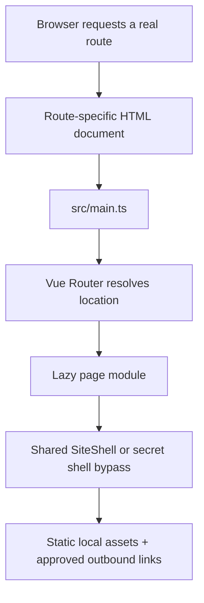

# Technical Architecture

**Status:** `IMPLEMENTED` foundation  
**Owns:** Runtime, build shape, MPA/router contract, module boundaries, state ownership, extension recipes, invariants  
**Implementation snapshot:** `b65e1c5a6da5a35f4f4f5969465c13f32f277912`  
**Update trigger:** Dependency, route, state, build, directory, integration, hosting assumption, or architecture invariant changes

## System summary

Nari Nuna's Haven is a static Vue application built as a true Vite multi-page application (MPA). Eleven HTML documents share one Vue entry and shell. Vue Router resolves the current URL and lazy-loads the corresponding page component, while primary navigation uses ordinary anchors and real document transitions.

There is no backend, account, database, CMS, form handler, analytics service, runtime social API, or trusted client secret boundary.



## Verified baseline

| Concern | Implementation |
|---|---|
| Runtime | Node.js 22.13+ |
| Package manager | npm with committed `package-lock.json` |
| UI | Vue 3.5.x, TypeScript 5.9.x |
| Build | Vite 8.2.x + `@vitejs/plugin-vue` 6.x |
| Routing | Vue Router 5.2.x |
| Styles | Sass/SCSS + semantic CSS custom properties |
| Motion | Motion for Vue (`motion-v`) + CSS transitions |
| Icons | `@lucide/vue` |
| Quality | ESLint 9, `vue-tsc`, Vitest, custom output validation |
| Output | Static `dist/` with eleven HTML documents and hashed assets |

Use exact versions resolved in `package-lock.json`. Do not hand-edit the lockfile or treat this table as an upgrade request.

## Why MPA and Router coexist

The architecture satisfies two deliberate requirements: real multi-page documents and Vue Router.

1. Each public route has a real HTML entry under the dedicated `pages/` document root.
2. Vite receives all entries through `build.rolldownOptions.input` and writes their unchanged public paths to the repository-level `dist/` directory.
3. Header and cross-room links are ordinary `<a>` elements.
4. Each document runs the same `/src/main.ts` entry.
5. Vue Router reads `window.location`, matches the route, and lazy-loads one page module.
6. Router provides route metadata, scroll reset, catch-all rendering, and future within-document route capability.
7. The hidden route uses route metadata to bypass the ordinary shell.

This is not an SPA fallback disguised as an MPA. Do not replace document links with `RouterLink` globally or remove entry documents because client navigation appears faster in development.

## Document and route registry

The following sources must stay synchronized:

| Concern | Source |
|---|---|
| HTML document root and page metadata | `pages/` |
| Build entries | `src/data/projectPages.json`, resolved by `vite.config.ts` |
| Client route matching | `routes` in `src/router/routes.ts` |
| Primary/footer visibility | `src/data/navigation.ts` |
| Output existence | `scripts/validate-build.mjs` |
| Route invariants | `tests/content-contract.test.ts` |
| Title/description/robots/theme metadata | Each HTML entry document |
| Product responsibility | Docs `00`, `02`, and `03` |

A route is incomplete if only one registry knows it exists.

## Repository map

```text
.
├── pages/                             # Vite document root; no page folders at repository root
│   ├── index.html                     # Home entry
│   ├── <route>/index.html             # Real route entries and route-specific metadata
│   └── 404.html                       # Static-host fallback entry
├── public/
│   ├── _headers                       # Host-compatible security/cache rules
│   ├── media/responsive/              # Content-addressed responsive derivatives
│   ├── icons + manifest
│   └── robots.txt
├── scripts/validate-build.mjs         # Eleven-document output contract
├── src/
│   ├── App.vue                        # Shell decision + RouterView
│   ├── main.ts                        # App bootstrap and stale-chunk recovery
│   ├── assets/source/                 # Project image masters; not served directly
│   ├── components/
│   │   ├── haven/                     # Progressive community/secret threshold
│   │   ├── layout/                    # Shared shell/header/footer
│   │   └── ui/                        # Media/heading/Ghostie primitives
│   ├── composables/                   # Motion preference state
│   ├── data/                          # Reviewed local content records
│   ├── pages/                         # One lazy module per route view
│   ├── router/                        # URL-to-page mapping and route metadata
│   ├── styles/                        # Tokens → base → components → pages → responsive
│   └── types/                         # Implemented content contracts
├── tests/                             # Vitest invariants
├── docs/                              # Product and operating specification
├── vite.config.ts
├── tsconfig.json
└── package.json + package-lock.json
```

## Bootstrap lifecycle

### Nari atmosphere metadata

Phase A is a proposed client-review demo. Every HTML document declares `data-theme="nari"` and the Nari `theme-color` directly, so first paint is deterministic without a preference boot script. The application does not read or write the historical `nari-haven-theme-v1` local-storage key; stale Dark/Light preferences therefore cannot affect rendering. Semantic CSS custom properties remain the styling boundary. See `28_NARI_ONLY_ATMOSPHERE_DEMO.md` for proposal status and rollback.

### Vue bootstrap

`src/main.ts`:

1. imports shared global SCSS;
2. creates the Vue app;
3. installs Router;
4. waits for Router readiness;
5. mounts to `#app`;
6. handles `vite:preloadError` by reloading once through normal browser behavior to recover stale hashed chunks after deployment.

### Shell selection

`App.vue` renders normal route views inside `SiteShell`. Routes with `meta.secret === true` bypass it. `SiteShell` owns the skip link, header, one main region, room passage and footer. The retained Ghostie summoner is not mounted.

Do not duplicate these concerns inside ordinary page components.

## Module boundaries

### Pages

Page modules own route composition and page-specific static content. Repeated content collections belong in typed data. Pages may compose components but should not reimplement global theme, navigation, or asset policy.

### Components

Components own reusable behavior and semantic patterns. A component should expose clear props/state rather than reach into unrelated page DOM. Avoid abstraction that turns distinct rooms into one configurable generic card page.

### Composables

Composables own shared reactive browser state. The current atmosphere is fixed in HTML and does not persist preferences. The retained reduced-motion helper owns a media-query subscription per consumer; one unmount cannot remove another consumer’s listener.

Do not add a global store until state truly crosses unrelated component trees and cannot be cleanly represented through props/composables/URL.

### Data and types

`src/data` contains reviewed local records; it does not scrape platform APIs. `src/types/content.ts` describes what the current code actually consumes. Richer planned editorial contracts are documented separately in `08_CONTENT_DATA_SCHEMAS.md` and must not be described as implemented until code validates them.

### Styles

Semantic visual values remain CSS custom properties so atmosphere and component code stay decoupled. SCSS compiles structural layers. Shared primitives begin in `_components.scss`; active interior compositions live in scoped `styles/rooms/` files. `_world.scss`, `_storybook.scss` and `_polish.scss` retain shared hero/material foundations. Final reading, focal-position and phone layers follow them in `main.scss`. Reordering layers requires cascade and browser evidence; document 38 records ownership.

## State ownership

| State | Owner | Persistence | Trust/privacy |
|---|---|---|---|
| Current route | Browser URL + Vue Router | History/document navigation | Public |
| Atmosphere | Route HTML + Nari semantic tokens | None | Public presentation only |
| Reduced motion | `matchMedia` via `useReducedMotion` | OS/browser preference | No storage |
| Mobile menu | `SiteHeader` local ref | None | UI-only |
| Retained Ghostie widget | Dormant `GhostieSummoner` local ref | None | Not mounted by the shell |
| Haven door step | `HavenDoor` local ref | None | Narrative, not auth |
| Floorboard open state | `LooseFloorboard` local ref | None | One optional toggle |
| Secret page | Tiny standalone view; no oath/counter | None | Optional public joke |

No current state belongs in a cookie, account, server session, URL parameter, or analytics event.

## Content and media flow

- Navigation, social links, featured media, community values, categories, and identity pillars are local TypeScript records.
- Pages render these records through normal Vue templates.
- Local source art is not imported into the bundle; optimized public derivatives are addressed by root-relative paths.
- YouTube thumbnails are the only approved remote image origin at the snapshot.
- All platform actions are outbound HTTPS links with `noopener noreferrer`.
- `frame-src 'none'` and `media-src 'none'` intentionally block embed/player expansion.

## Security boundary

The browser is untrusted and the output is public static code.

- `VITE_*` is public.
- No secret, token, webhook, email credential, moderation credential, or private ID belongs in source or build configuration.
- No unsanitized HTML is rendered.
- A future Markdown/CMS boundary requires runtime schema validation and allowlist sanitization.
- `robots.txt`, `noindex`, and a hidden route are not access control.
- A future form requires a real backend/privacy/spam/error design; a client-only fake form is prohibited.

## Build and quality commands

| Command | Contract |
|---|---|
| `npm run dev` | Vite development server |
| `npm run lint` | ESLint across repository excluding build/cache paths |
| `npm run typecheck` | `vue-tsc --noEmit` |
| `npm run test` | Vitest content-contract suite |
| `npm run build` | Typecheck → Vite MPA build → document and performance validators |
| `npm run check` | Lint → typecheck → test → build → HTTP preview verification |
| `npm run preview` | Preview built production artifact |

The last recorded implementation evidence on 2026-08-13 stated that `npm run check` passed with four tests and eleven output documents. Treat this as historical evidence for the snapshot, not proof for a later commit. Re-run the gate.

## Architecture invariants

The following are merge blockers unless intentionally changed through an accepted decision record:

- all eleven documents build and direct-load;
- primary top-level navigation remains real document navigation;
- shared shell is component-owned, not copied per page;
- page modules remain lazy;
- fixed Nari atmosphere paints before Vue without reading a persisted preference;
- no Tailwind/general UI kit/second scaffold;
- no backend-dependent claim without a backend;
- no unapproved third-party script, iframe, or runtime feed;
- no client secret;
- public assets are local/approved and explicitly sized;
- hidden route remains optional, no-index, and non-private;
- output remains portable to a static host meeting the runbook contract.

## Adding a route

1. Approve the route responsibility in docs `00`, `02`, and `03`.
2. Add `pages/<route>/index.html` with route-specific title, description, fixed Nari atmosphere metadata, icons/manifest, and module entry.
3. Add the HTML path to `src/data/projectPages.json`, resolved by `vite.config.ts`.
4. Add the explicit lazy route record in `src/router/routes.ts`.
5. Create the page module under `src/pages`.
6. Add navigation only at the IA-approved priority.
7. Output/preview/preload validators derive their coverage from the registry; verify the document contract test.
8. Update route/data tests and count assumptions.
9. Update host routing, metadata, docs, QA matrix, and sitemap/robots intent if applicable.
10. Run `npm run check`, then direct-load the built route and test back/forward/refresh/trailing slash.

## Adding an integration

Before adding a CMS, embed, form, analytics tool, schedule API, or social API, document:

- product purpose and why static local data is insufficient;
- data controller/processor and destinations;
- authentication and secret boundary;
- schema and trust validation;
- consent, retention, deletion, access, and incident owner;
- CSP/network changes;
- loading, failure, offline, and fallback states;
- accessibility and performance cost;
- price, vendor lock-in, export, and removal plan;
- test and monitoring evidence.

If these questions are premature, the integration is premature.

## Deployment contract

Architecture remains provider-neutral. The host must serve directory indexes, map unknown paths to `404.html`, enforce security/cache headers, support HTTPS, preserve root-relative assets, and permit atomic rollback. Detailed deployment and verification live in `15_DEPLOYMENT_AND_RELEASE_RUNBOOK.md`.

## 2026-09-05 performance delivery delta

A Vite HTML transform generates route-specific, media-matched hero preloads from the shared artwork delivery module for nine ordinary documents. CSS backgrounds and native picture sources select the same content-addressed candidates. All eleven documents and lazy route modules remain. The build manifest now feeds a transitive JS/CSS budget gate. The Haven interior has proximity/focus/knock loading with observer cleanup. Stale chunks use a session-scoped one-reload guard with manual failure recovery. See [implementation and evidence](33_RESPONSIVE_ARTWORK_PERFORMANCE.md).

## 2026-09-11 maintenance representation

`prepare-responsive-artwork.py` writes the full provenance manifest plus `responsive-artwork.runtime.json` from one candidate set. Browser helpers import only the compact representation; tests compare the complete selection projection and the build rejects known provenance markers in shared chunks. All candidate/source bytes remain unchanged. Fragment scrolling reads reduced motion at navigation time while saved history positions retain precedence. See [maintenance evidence](37_SIZE_MAINTENANCE.md).
