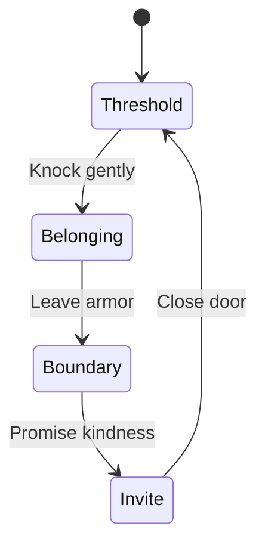

# Interaction and Motion Specification

**Status:** Core interactions `IMPLEMENTED`; final manual/device review `PENDING`  
**Owns:** Interaction state, timing, input parity, focus, delight limits, reduced-motion equivalence  
**Implementation files:** `SiteHeader.vue`, `GhostieSummoner.vue`, `HavenDoor.vue`, `LooseFloorboard.vue`, `PrinnyCultPage.vue`, SCSS
**Update trigger:** New/changed interaction, shortcut, animation, live region, menu, theme, or reveal behavior

## Motion thesis

Motion is punctuation, not wallpaper. It may confirm a state, reveal a small delight, or add material response. It never delays content, blocks navigation, changes the truth of a disclaimer, or becomes necessary to understand what happened.

Every action must remain clear and complete with animation disabled.

## Timing system

| Class | Range | Use | Avoid |
|---|---:|---|---|
| Instant/state | 0–120ms | Pressed/selected/focus feedback | Meaningful content travel |
| Fast | 140–180ms | Button/link hover/tap | Large panels |
| Base | 240–320ms | Ghostie card, small reveal | Chained page choreography |
| Large | 360–500ms | Rare image/card emphasis | Blocking route/navigation |

Default ease-out: `cubic-bezier(0.22, 1, 0.36, 1)`. Avoid spring overshoot on reading surfaces and staged delays that make visitors wait.

## Cross-document navigation

Top-level routes are real document navigations. No cross-document animation is required. Previous experimental browser View Transitions were removed after rapid navigation produced cancelled-operation console noise.

Future cross-document transitions must be progressive enhancement and must:

- preserve normal navigation/history when unsupported;
- never delay link activation;
- never trap an old page state;
- not cause console/runtime errors under rapid clicks/back-forward;
- honor reduced motion;
- be justified by observed improvement, not novelty.

## Interaction state machines

### Nari-only atmosphere demo

Phase A removes the theme switcher and persisted theme interaction from the client-review build. Atmosphere is fixed by route metadata before Vue loads, so there is no theme-specific focus, keyboard, animation, or storage state. This is a reversible proposal pending client approval, documented in `28_NARI_ONLY_ATMOSPHERE_DEMO.md`.

### Mobile navigation

States: closed ↔ open.

Open through the labelled menu button. Close through button, Escape, or selecting a route. While open, body scroll is locked. `aria-expanded` and `aria-controls` expose state.

Pending manual determination: whether focus containment and explicit focus return are required for the panel at release. Do not state that these are implemented until tested and added.

### Ghostie summoner

States: closed ↔ open.

Full motion: opacity + 24px rise + scale over 280ms.  
Reduced motion: static/immediate or opacity-only state.  
Inputs: visible button and visible close button; no idle autoplay.  
Semantics: compact status message; avoid repeated live-region announcements.

The fixed layer must stay below the header's critical stacking context and away from required controls/browser edges.

### Haven door

The Discord anchor exists only at `Invite`. Progress bars are decorative reinforcement; headings, paragraph, and button labels carry the state. This is narrative sequencing, not security or consent storage.

### Loose floorboard

States: untouched → first knock → second knock → gatekeeper listening → password accepted.

- One visible native button advances exactly three capped floorboard knocks.
- A supplied original Prinny rises from the illustrated boards as a decorative state cue.
- The listening gatekeeper presents three labelled native password buttons.
- Incorrect answers announce a harmless, polite explanation without losing progress.
- Only `DOOD` accepts the password; only the accepted state renders the normal hidden-route link.
- Text changes in an `aria-live="polite"` region.
- No hover, timing, precision, or sound is required.
- The interaction is optional and contains no essential page action.

### Prinny initiation and eleventh offering

States: candle rite → sardine rite → sacred-word rite → oath → initiated; offering count 0–11.

- Three labelled native buttons advance the respective candle, sardine, and `DOOD` rites.
- The same actions can be completed through three labelled native hotspots on the dedicated altar painting; future rites remain visibly disabled until the previous rite is complete.
- A numbered list exposes completed/current rites without relying on glow or color.
- The optional oath button appears only after all three rites.
- The ceremonial title describes the visitor only; it never invents a supplied Prinny's identity, rank, or biography.
- The sardine-offering button exists only after initiation and caps the counter at 11.
- Counter updates are exposed politely, and the eleventh offering reveals the final visitor-only joke title.
- The fixed candlelight is decorative; the only animation is optional, brief visual-state feedback.
- A visible return link is available from the start and again at the bottom of the route.
- Each supplied congregation image has a visible-focus native button that reveals a harmless generic witness whisper; no individual lore, status, or roster identity is created.

## Implemented behavior matrix

| Interaction | Full-motion behavior | Reduced-motion replacement | Required inputs |
|---|---|---|---|
| Buttons/cards | 2–6px lift; rare 0.25° rotation | No transform; color/border | Hover, focus, tap |
| Theme | Token transition ~280ms | Near-instant | Keyboard/touch/pointer |
| Ghostie | Opacity/rise/scale | Static/opacity | Open and close buttons |
| Mobile nav | Immediate panel state | Same | Menu, Escape, link selection |
| Haven door | Content/state replacement | Same, no travel | Native buttons |
| Floorboard | Three knocks, decorative Prinny reveal, visible password choice | Same, without gatekeeper transition | Native investigation and password buttons |
| Secret | Three rites, optional oath, ceremonial visitor title, capped sardine counter | Same, without glow/card transitions | Native labelled buttons and visible return links |
| Media image | Small scale on card hover | No scale | Link focus retains affordance |

## Future Ghostie/emote behavior

- User action or meaningful completion triggers delight.
- Maximum instance count and cooldown are explicit.
- Decorative sprites use transform/opacity and `pointer-events: none`.
- Stop effects when the document becomes hidden.
- Do not spawn continuously, on scroll, before consent/action, or over reading/focus targets.
- Canonical emotes require website and animation rights.
- Reduced motion uses a static cue or no decorative cue.
- No autoplay audio, repeated speech, flashing emerald, or random jump scare.

## Environmental response budget

Allowed examples:

- lamp glow subtly strengthens after theme selection;
- one Ghostie peeks after a meaningful completion;
- a pillow shifts after deliberate inspection.

Each needs one trigger, one cap/cooldown, a touch/keyboard equivalent where interactive, and a reduced-motion state.

Never animate:

- body copy while it is being read;
- support/privacy/safety disclaimers;
- primary navigation position;
- form labels/errors if forms are later approved;
- professional metrics;
- a background parallax layer tied to scroll;
- infinite particles or sprite rain.

## Focus and announcement rules

- Decorative reveals do not move focus.
- Opening a lightweight Ghostie status card does not steal focus.
- If a future modal/detail viewer is introduced, it must manage initial focus, containment, Escape, and return.
- Live regions announce meaningful state once, not every animation frame.
- State changes remain visible in ordinary text.
- Keyboard shortcuts never fire inside text inputs if such inputs are later added.

## Mobile and touch

- Practical touch target is at least 44×44 CSS px.
- Hover is enhancement only.
- Fixed controls do not collide with mobile navigation, safe areas, or browser chrome.
- Multi-column motion and decorative density collapse before controls or type shrink.
- Test repeated rapid taps; state machines must cap and remain deterministic.

## Reduced motion

The operating-system `prefers-reduced-motion` preference is authoritative. Current CSS:

- disables smooth scroll;
- collapses animation/transition duration to effectively instant;
- limits iterations;
- removes hover transforms;
- passes a reactive boolean to Motion for Vue.

Do not add a separate site preference without an owner requirement and a clear precedence model.

## Performance rules

- Animate compositor-friendly transform/opacity.
- One focal animated event at a time.
- No autoplay video/audio, canvas field, WebGL decoration, or perpetual loop.
- Avoid layout-property animation.
- Test on representative mid-range mobile hardware before adding sprite bursts.
- Inspect rapid navigation/activation for stale state and cancelled-operation errors.

## Interaction QA script

For each interaction:

1. Complete with keyboard only.
2. Complete with touch/pointer only.
3. Repeat rapidly and attempt over-activation.
4. Test at 320px and 400% zoom.
5. Enable reduced motion before load and while the page is open.
6. Check focus order, visibility, and whether focus unexpectedly moves.
7. Check screen-reader announcement count and clarity.
8. Navigate away/back/refresh and confirm intended reset/persistence.
9. Block images/network where relevant and confirm the action remains understandable.

Record actual evidence in the release record; implementation intent is not a pass.
