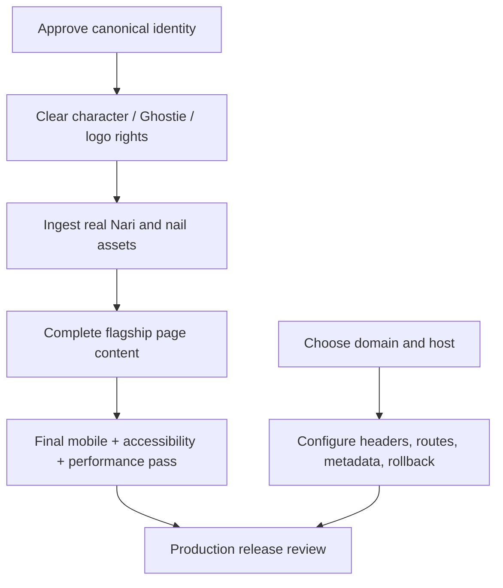

# Implementation Roadmap and Phase Gates

**Status:** Foundation implemented; production release blocked  
**Owns:** Work sequence, dependency gates, current state, completion evidence, rollback risk  
**Update trigger:** A phase starts/completes/blocks, an input arrives, or priorities change

Statuses describe evidence at the documentation baseline. `IMPLEMENTED` does not mean Nari-approved or production-cleared.

## Phase map

| Phase | Outcome | Primary files/systems | Gate | Status |
|---:|---|---|---|---|
| 0 | Product/canon/rights baseline | Docs `00`, `05`, `06`, `16` | Blockers and authority recorded | `IMPLEMENTED`; canon still `BLOCKED` |
| 1 | True MPA and shared shell | Vite config, HTML entries, Router, layout | 11 docs build/direct-load; shared shell | `IMPLEMENTED` |
| 2 | Theme and design foundation | Theme boot/composable, SCSS tokens/layers | Pre-paint persistence; three themes | `IMPLEMENTED`; final contrast pending |
| 3 | Placeholder asset pipeline | Source masters, generated derivatives, manifest | Hash/rights/status/dimensions recorded | `IMPLEMENTED` for placeholders |
| 4 | Home world and gateways | `HomePage`, hero/gateway/media styles | Nari-specific arrival, correct CTA hierarchy | `IMPLEMENTED`; final art pending |
| 5 | Meet Nari canon | `MeetNariPage`, character assets/content | Approved identity/lore/render/credit | `BLOCKED` |
| 6 | Streams curation | `StreamsPage`, media data | Approved clips/rating/links; no autoplay | Foundation `IMPLEMENTED`; final approval pending |
| 7 | Nail Studio flagship | `NailStudioPage`, future gallery/guides | Real approved work, labels, rights, safety review | Structure `IMPLEMENTED`; content `BLOCKED` |
| 8 | Haven and community entry | Haven page/components, Discord link | Values work; canonical invite verified | Interaction `IMPLEMENTED`; invite pending |
| 9 | Resource cabinet | Resources page, future records | Approved items, context, disclosure | Curating state `IMPLEMENTED` |
| 10 | Professional path | Work page, future metrics/contact | Approved contact/media kit/metrics | Structure `IMPLEMENTED`; inputs `BLOCKED` |
| 11 | Support boundaries | Support page, support links | Optionality precedes valid methods | Foundation `IMPLEMENTED`; final copy review pending |
| 12 | Story system | Stories page, future records | Approved privacy-reviewed stories | Foundation/schema `IMPLEMENTED`; content pending |
| 13 | Delight/secret layer | Ghostie, floorboard, secret | Input parity, reduced motion, original assets | Foundation `IMPLEMENTED` |
| 14 | Final asset integration | All art/content slots | Canonical sources, crops, alt/credits, budgets | `BLOCKED` on inputs |
| 15 | Mobile/accessibility/performance pass | All routes and shared systems | Full manual matrix with final content | `PENDING` |
| 16 | Host/domain integration | Provider config, metadata, redirects/headers | Direct routes, 404, HTTPS, canonical, rollback | `BLOCKED` on provider/domain |
| 17 | Production clearance | Full repo and release record | All critical QA/rights/privacy gates pass | `BLOCKED` |

## Immediate critical path

Professional contact, resources, stories, schedule, metrics, and support methods can progress in parallel when approved, but they do not replace the identity/art/nail critical path.

## Phase execution rule

For every unfinished phase:

1. Re-read source of truth and specialist docs.
2. Name inputs, owner, rights, privacy, and expiry before implementation.
3. Create or update an approval/asset/decision record.
4. Make the smallest coherent system change.
5. Run narrow checks during work and `npm run check` before handoff.
6. Direct-load affected routes; inspect all themes, target widths, keyboard, reduced motion, and error state.
7. Record actual evidence and remaining uncertainty.
8. Update roadmap, QA status, docs, and rollback notes.

## Next work packets

### Packet A — Canonical identity and visual pack

**Inputs:** Nari's CatDog/Grim Reaper wording; current character art; official Ghostie/emotes; logo/wordmark; sun/moon wording/art.  
**Work:** Rights intake, responsive derivatives, Meet Nari/Home/header/footer replacement, alt/credit, theme/crop review.  
**Gate:** All uses explicitly permitted; no placeholder presented as canonical; lore internally coherent.  
**Rollback:** Restore placeholder references and labels without deleting canonical masters.

### Packet B — Nail Studio production content

**Inputs:** Original nail photos, set labels, technique/material notes, photographer/owner approval, education topics.  
**Work:** Privacy/EXIF inspection, image optimization, typed gallery records, gallery/detail behavior if needed, guide/resource linkage.  
**Gate:** Every work real/approved; no service/medical implication; detail quality and budgets pass.  
**Rollback:** Retire data records and return to honest gallery hold.

### Packet C — Operational content

**Inputs:** Canonical Discord, business contact/media kit, approved metrics, resources/relationships, support methods, stories, schedule workflow.  
**Work:** Migrate one target schema at a time; add tests, states, disclosures, expiry.  
**Gate:** Each record sourced, approved, current, removable, and privacy-safe.  
**Rollback:** Retire record; preserve honest fallback.

### Packet D — Final quality pass

**Inputs:** Final content/art and stable feature set.  
**Work:** 320/390/768/wide, all themes, contrast, zoom, keyboard, screen reader, reduced motion, link/media failures, performance budgets.  
**Gate:** No critical accessibility/privacy/rights/performance defect; evidence recorded.  
**Rollback:** Remove/regress the offending content system through focused commit, not broad reset.

### Packet E — Deployment and release

**Inputs:** Provider, domain, access owners, legal/license decisions, rollback mechanism.  
**Work:** Configure routes/404/headers/caches/canonical/social metadata, protect previews, deploy, verify, document rollback.  
**Gate:** Production evidence record complete; all critical blockers closed.  
**Rollback:** Atomic previous-known-good deployment tested.

## Definition of phase complete

A phase is complete only when:

- intended behavior/content is implemented;
- required approval and rights records exist;
- automated checks pass;
- manual checks relevant to the phase are observed;
- docs describe actual behavior;
- risks and follow-up are explicit;
- rollback is practical;
- no placeholder or historical evidence is mislabeled as final.

## Change grouping

Keep pull requests focused by system or asset family. Avoid combining:

- dependency upgrades with visual redesign;
- lore approval with unrelated code refactors;
- character art and nail-gallery ingestion in one unreviewable asset dump;
- hosting configuration with unfinished content;
- broad formatting changes with substantive documentation edits.

Focused changes make rights review and rollback possible.

## Rollback policy

- Never overwrite supplied masters during optimization.
- Keep approved content in removable typed records.
- Preserve honest holds as safe fallbacks until final content is proven.
- Roll back with a normal revert or previous deployment, not a destructive force-reset.
- Document any data/cache invalidation needed when external behavior is introduced.
- Production must retain a known previous-good artifact before cutover.
